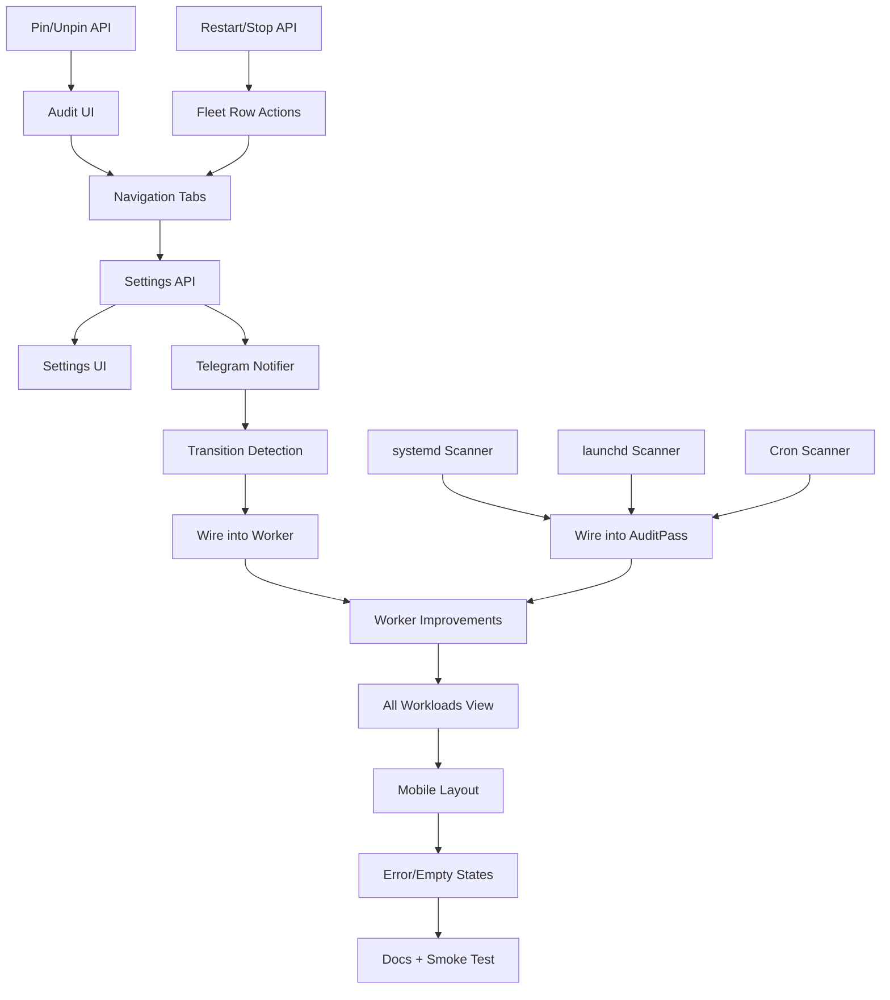

# Finish v1: Remaining PLAN.md Implementation

All work follows the project's established TDD flow. Each slice is independently deployable on the hub via `deploy-hub.sh`.

---

## Development Standards (non-negotiable)

Every task in this plan MUST follow the existing standards documented below. These are not aspirational -- they are enforced by CI and have been maintained at 100% since the project started.

### TDD Ceremony: Red-Green-Refactor

The [specs/README.md](specs/README.md) iron law: **"no production code without a failing test derived from an AC."**

For every new feature:

1. **Write the spec first** -- a markdown file in `specs/` with numbered FRs (functional requirements) and ACs (acceptance criteria in Given/When/Then form). Follow the format established by [specs/03-docker-scanner.md](specs/03-docker-scanner.md) and [specs/04-severity.md](specs/04-severity.md).
2. **Write failing tests (RED)** -- test functions named `test_ac_X_Y_description()` referencing the AC number (e.g., `# AC-14.3`). Run `uv run pytest` and confirm they fail.
3. **Write minimal implementation (GREEN)** -- just enough code to pass the tests.
4. **Refactor** -- clean up while keeping tests green.
5. **Verify coverage gate** -- `uv run pytest --cov=mac_mini_core --cov=mac_mini_api --cov=mac_mini_worker --cov-branch --cov-report=term-missing` must pass at 100%.

### Coverage Gates (CI-enforced)

Python (from [pyproject.toml](pyproject.toml)):
- `tool.coverage.run`: branch = true, source = `mac_mini_core`, `mac_mini_api`, `mac_mini_worker`
- `tool.coverage.report`: **fail_under = 100** (100% branch coverage, no exceptions)
- Omits `__init__.py` files

Web (from [apps/web/vitest.config.ts](apps/web/vitest.config.ts)):
- Provider: v8, includes `src/**/*.{ts,tsx}`
- Excludes: `src/main.tsx`, `src/types.ts`
- Thresholds: **100% lines, branches, functions, statements**

Both gates run on every push/PR via [.github/workflows/ci.yml](.github/workflows/ci.yml).

### Testing Patterns (follow exactly)

**Python -- core logic** (e.g., scanners, severity, promote, alert):
- Use `FakeSshExecutor` with pre-loaded responses keyed by `(CommandTemplate, args)` -- never real SSH
- Use JSONL fixture files in `packages/core/tests/fixtures/` for scanner output
- Helper functions like `_host()`, `_config()`, `_executor()` for test setup
- `tmp_path` for ephemeral SQLite databases
- Root [conftest.py](conftest.py) auto-closes all `WorkloadStore` instances after each test

**Python -- API endpoints**:
- `FastAPI TestClient` with injected `WorkloadStore` and `FakeSshExecutor`
- `seeded_store` pytest fixture that runs `AuditPass` against fixtures to populate DB
- Test both success paths and error paths (404, 400, 502)

**Python -- worker**:
- Inject fake `clock` and `sleeper` into `WorkerScheduler` for deterministic timing
- Test `tick()` and `run_forever(max_ticks=N)` with `FakeSshExecutor`

**Web -- React components**:
- Vitest + React Testing Library + `@testing-library/user-event`
- Mock `FleetClient` interface with `vi.fn()` -- never hit real API
- Use `initialWorkloads` prop to bypass fetch in unit tests
- Test user interactions (click, type) via `userEvent.setup()`
- Assert DOM state (`getByText`, `getByRole`, `queryByRole` for absence)

### New Spec File Template

Every new feature gets a spec before any code. Follow this structure:

```markdown
# Spec NN -- Title

| Field | Value |
|-------|-------|
| Status | **Approved** |
| Source | PLAN.md section |
| Author | mac-mini-dashboard |

## Context
One paragraph on what and why.

## Functional Requirements
- **FR-1:** ...
- **FR-2:** ...

## Acceptance Criteria
- **AC-NN.1:** Given ..., when ..., then ...
- **AC-NN.2:** Given ..., when ..., then ...

## Edge Cases
- **EC-NN.1:** ...

## Out of Scope
- ...
```

### New Scanner Fixture Template

Each scanner needs fixture files in `packages/core/tests/fixtures/<kind>/` containing realistic command output. Follow the Docker pattern: [packages/core/tests/fixtures/docker/](packages/core/tests/fixtures/docker/) has `ps_standalone.jsonl`, `ps_compose.jsonl`, `ps_exited.jsonl`, `ps_duplicate.jsonl`, `ps_malformed.jsonl`. New scanners (systemd, launchd, cron) need equivalent fixture files with realistic output from their respective commands.

### Update specs/README.md

After each spec is approved and tests pass, add a row to [specs/README.md](specs/README.md) linking the spec, its status, and its test files.

---

## Slice 1 — Pin/Unpin + Restart/Stop + Audit UI

**Goal:** Complete the control loop so workloads can be promoted, restarted, and stopped from the dashboard.

### 1a. Pin/Unpin API

New spec `specs/14-api-pin.md` with ACs. Two endpoints in [apps/api/src/mac_mini_api/app.py](apps/api/src/mac_mini_api/app.py):

- `POST /api/workloads/{id}/pin` — set `pinned=1, monitored=1` in `workloads` table
- `DELETE /api/workloads/{id}/pin` — set `pinned=0`, re-evaluate `monitored` via `should_promote()`

Add `pin_workload()` and `unpin_workload()` methods to [WorkloadStore](packages/core/src/mac_mini_core/store.py). Unpin must re-run promote logic to decide if the workload stays monitored.

### 1b. Restart + Stop API

New spec `specs/15-api-restart-stop.md`. Two endpoints:

- `POST /api/workloads/{id}/restart` — resolve workload kind, execute the appropriate allowlisted command (`DOCKER_RESTART`, `SYSTEMCTL_RESTART`, `LAUNCHCTL_KICKSTART`)
- `POST /api/workloads/{id}/stop?confirm=1` — Docker: `docker stop`, systemd: `systemctl stop`. Require `confirm=1` query param or 400.

New `docker_stop` command template needed in [commands.py](packages/core/src/mac_mini_core/ssh/commands.py). Add `DOCKER_STOP`, `SYSTEMCTL_STOP` to the `CommandTemplate` enum. Create `control.py` in core with `restart_workload()` and `stop_workload()` functions (testable with `FakeSshExecutor`).

### 1c. Audit UI View

Add `AuditView` component to the web app — shows `GET /api/audit` results with a "Pin" button per row. Add client methods `pinWorkload()`, `unpinWorkload()` to [client.ts](apps/web/src/api/client.ts).

### 1d. Fleet Row Actions

Add Restart and Stop buttons to each row in [FleetView.tsx](apps/web/src/components/FleetView.tsx). Stop requires a confirmation dialog. Add `restartWorkload()`, `stopWorkload()` to the client.

### 1e. Navigation

Add a minimal tab bar or nav to [App.tsx](apps/web/src/App.tsx): **Fleet** (default) | **Audit** | **Settings** (placeholder).

**Files touched:** `app.py`, `store.py`, `commands.py`, new `core/control.py`, `client.ts`, `types.ts`, `App.tsx`, `FleetView.tsx`, new `AuditView.tsx`, 2 new specs, tests for each.

---

## Slice 2 — Telegram Notifier + Settings API/UI

**Goal:** Alerting on severity transitions. Settings page to configure it.

### 2a. Settings API

New spec `specs/16-settings-api.md`. Two operations:

- `GET /api/settings` — returns `{ notify_orange: bool, notify_red: bool }` from the `settings` table (already has defaults via [db.py](packages/core/src/mac_mini_core/db.py))
- `PATCH /api/settings` — accepts partial JSON body, updates `settings` rows

Add `get_settings()` and `update_settings()` to `WorkloadStore`.

### 2b. Telegram Notifier (core)

Spec 09 is already written ([specs/09-telegram.md](specs/09-telegram.md)). Implement in new `packages/core/src/mac_mini_core/telegram.py`:

- `TelegramNotifier` class: takes `bot_token`, `chat_id`, `httpx.AsyncClient` (or sync `httpx.Client`)
- `send_alert(host, workload_name, severity, reason, dashboard_url)` — calls `https://api.telegram.org/bot<token>/sendMessage`
- Testable with a `FakeTelegramNotifier` or by injecting a mock HTTP client

### 2c. Severity Transition Detection + Debounce

New `packages/core/src/mac_mini_core/alert.py`:

- `should_alert(workload_id, old_severity, new_severity, settings, last_alert_time)` — returns bool
- Transition logic: only alert when severity **changes** (green->orange, green->red, orange->red)
- Debounce: max 1 message per 15 min per workload, unless red
- Add `alert_history` table to [db.py](packages/core/src/mac_mini_core/db.py) schema: `(workload_id, severity, sent_at)`

### 2d. Wire into Worker

Modify [PollPass](packages/core/src/mac_mini_core/worker/poll.py) or [WorkerScheduler](apps/worker/src/mac_mini_worker/scheduler.py):

- After `apply_poll_update()`, compare old vs new severity
- If `should_alert()` returns true, call `TelegramNotifier.send_alert()`
- Read settings from store
- Env vars: `TELEGRAM_BOT_TOKEN`, `TELEGRAM_CHAT_ID` (already in `.env.example`)

### 2e. Settings UI

New `SettingsView` component: toggle switches for `notify_orange` and `notify_red`. Wire to `GET/PATCH /api/settings` via client.

**Files touched:** `app.py`, `store.py`, `db.py`, new `telegram.py`, new `alert.py`, `poll.py` or `scheduler.py`, `client.ts`, new `SettingsView.tsx`, `App.tsx`, 2 new specs, tests for each.

---

## Slice 3 — Additional Scanners

**Goal:** See non-Docker workloads across the fleet (systemd on Linux, launchd on macOS, cron).

### 3a. systemd Scanner

New spec `specs/17-systemd-scanner.md`. New `packages/core/src/mac_mini_core/scanners/systemd.py`:

- `SystemdScanner.discover(host, executor)` — runs `systemctl list-units --type=service --state=running --no-pager --plain` (new command template)
- Produces `WorkloadSnapshot` with `kind=systemd`, `workload_id=systemd:<host>:<unit>`
- Only run on `host.os == "linux"`

### 3b. launchd Scanner

New spec `specs/18-launchd-scanner.md`. New `packages/core/src/mac_mini_core/scanners/launchd.py`:

- `LaunchdScanner.discover(host, executor)` — runs `LAUNCHCTL_LIST` (template already exists)
- Parses tab-separated output (PID, status, label)
- Produces `WorkloadSnapshot` with `kind=launchd`, `workload_id=launchd:<host>:<label>`
- Excludes `com.apple.*` labels per PLAN.md exclude rules
- Only run on `host.os == "darwin"`

### 3c. User Cron Scanner

New spec `specs/19-cron-scanner.md`. New `packages/core/src/mac_mini_core/scanners/cron.py`:

- `CronScanner.discover(host, executor)` — runs `CRONTAB_LIST` (template exists)
- Hashes each cron line for stable `workload_id=cron:<host>:<hash>`
- `status` is always `scheduled` (cron has no running state)

### 3d. Wire Scanners into AuditPass

Modify [AuditPass](packages/core/src/mac_mini_core/worker/audit.py) to accept a list of scanners, dispatch based on `host.os`. Update [scanners/__init__.py](packages/core/src/mac_mini_core/scanners/__init__.py) exports.

### 3e. Add `SYSTEMCTL_LIST_UNITS` command template

Add to [commands.py](packages/core/src/mac_mini_core/ssh/commands.py): `systemctl list-units --type=service --state=running --no-pager --plain`. Also add `DOCKER_STOP` and `SYSTEMCTL_STOP` if not done in Slice 1.

**Files touched:** `commands.py`, `scanners/__init__.py`, new `scanners/systemd.py`, new `scanners/launchd.py`, new `scanners/cron.py`, `audit.py`, 3 new specs, fixture files for each scanner, tests for each.

---

## Slice 4 — Polish + Hardening

**Goal:** Production readiness for v1.

### 4a. Worker Improvements

- **Log tail scanning during poll:** Modify `PollPass` to fetch `docker logs --tail 50` for monitored workloads and pass `log_tail` to `evaluate_severity()` (the severity engine already supports it, just not wired)
- **Restart count tracking:** Parse Docker `RestartCount` from `docker inspect` output, update `restart_count_1h` in `workload_state`
- **Per-host poll interval:** `WorkerScheduler` should respect `host.poll_interval_sec` overrides (stagger polls per host instead of one global tick)

### 4b. All Workloads Flat Table View

New `AllWorkloadsView` component: flat sortable table (host, name, kind, state, severity, updated). Uses `GET /api/workloads` without `?monitored=true`. Add to nav.

### 4c. Mobile Layout

Responsive pass on `FleetView` and `AllWorkloadsView`: table on desktop, stacked cards on `<640px`. Touch-friendly action buttons.

### 4d. Error + Empty States

- Empty states for each view (no workloads, no audit items, no settings changes)
- Better error handling in the UI (network errors, SSH failures)
- Loading skeletons during fetch

### 4e. SSH Onboarding Doc + Smoke Test

- Standalone `docs/ssh-onboarding.md` with the checklist from PLAN.md Section 6
- `scripts/smoke-test.sh`: seed DB, start API, hit key endpoints, verify responses

**Files touched:** `poll.py`, `scheduler.py`, new `AllWorkloadsView.tsx`, `FleetView.tsx`, `App.tsx`, CSS/Tailwind, new docs, new script.

---

## Dependency Graph



## Time Estimates

| Slice | Effort | Ship target |
|-------|--------|-------------|
| Slice 1 (controls + audit UI) | ~2 sessions | Week's end |
| Slice 2 (Telegram + settings) | ~2 sessions | Following week |
| Slice 3 (scanners) | ~2 sessions | Same week or next |
| Slice 4 (polish) | ~2 sessions | Final week |

Slices 1 and 2 are sequential. Slice 3 is independent and can be parallelized with Slice 2. Slice 4 depends on all prior slices.
